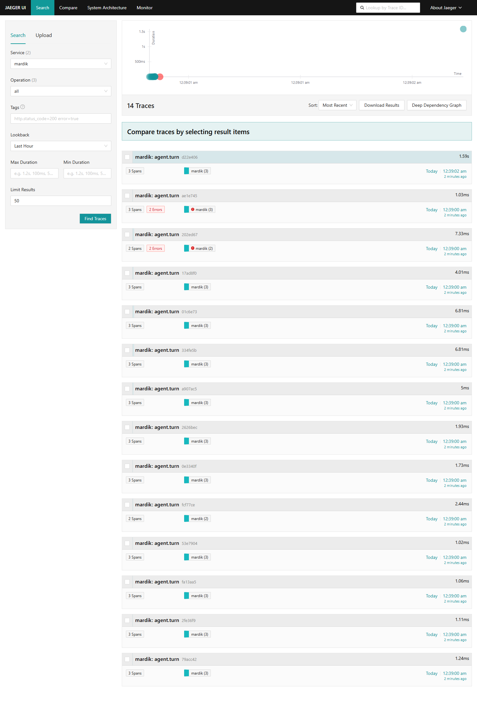
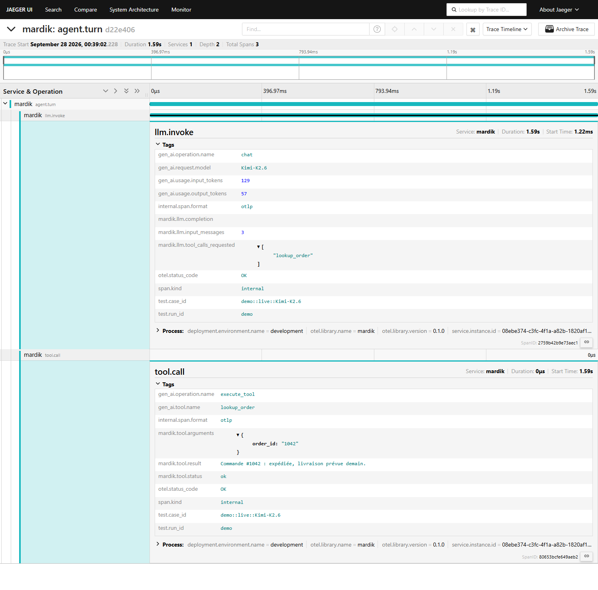
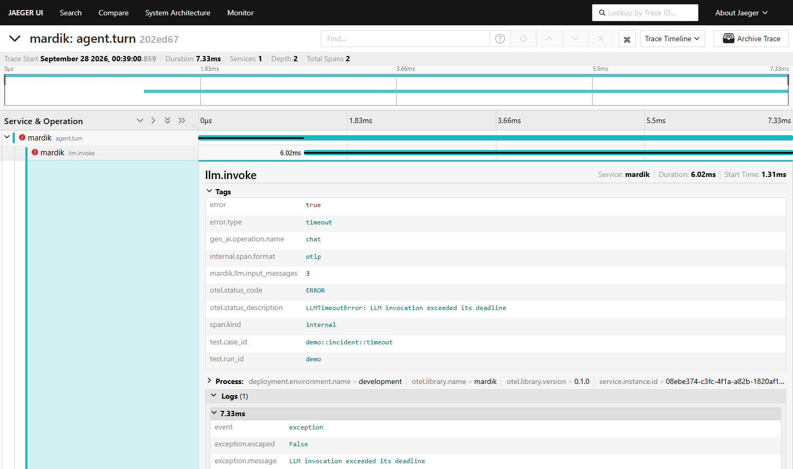
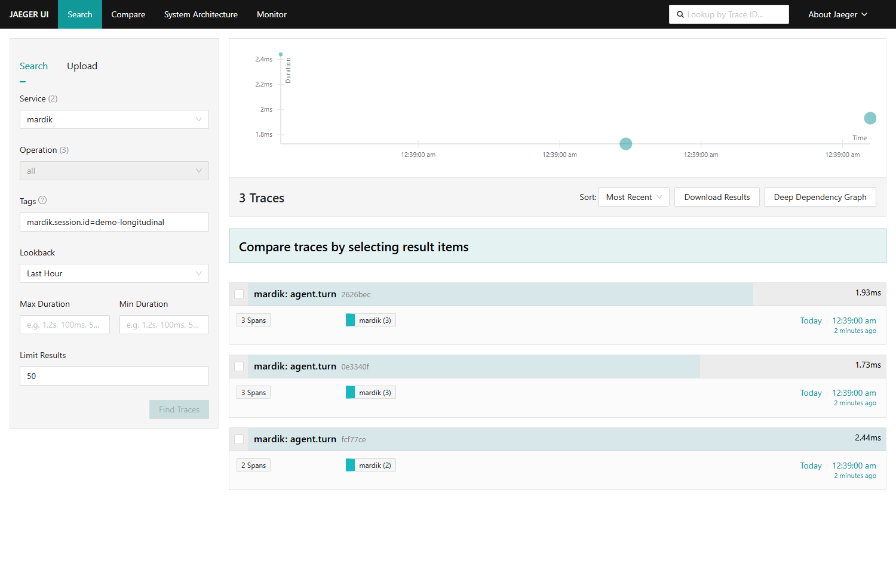

# Démo : voir enfin ce qui se passe dans Mardik

Cette démo montre, dans Jaeger, les traces de l'agent Mardik : des sessions rejouées, deux
incidents provoqués et un tour réel avec le modèle Kimi-K2.6. Elle se lance en une commande.
Les captures ci-dessous viennent d'une exécution réelle de cette commande ; elles permettent de
suivre la démo sans rien installer.

## Lancer la démo

Prérequis : Docker Desktop démarré, `uv`, Python 3.11, `make`.

```bash
make install     # une seule fois : installe les dépendances
make demo        # démarre Jaeger, envoie les traces, ouvre l'interface
```

`make demo` démarre Jaeger (Docker), attend qu'il réponde, rejoue les scénarios et ouvre
http://localhost:16686 sur le service `mardik`. `make down` arrête Jaeger.

Sans `make` :

```bash
docker compose up -d
uv run --env-file .env python scripts/demo_traces.py --jaeger --wait --live
```

Le **tour réel** avec Kimi-K2.6 n'a lieu que si un fichier `.env` contient `AZURE_AI_ENDPOINT`,
`AZURE_AI_API_KEY` et `AZURE_AI_MODEL` (modèle : `.env.example`). Sans clé, la démo l'annonce
(`ignoré  live`) et montre les scénarios scriptés seuls ; sans `.env`, retirer
`--env-file .env` de la seconde commande.

## Ce que la démo envoie

| Scénario (`test.case_id`)       | Traces | Ce qu'il montre                                                  |
| ------------------------------- | ------ | ---------------------------------------------------------------- |
| `demo::replay::<session>`       | 4      | Chaque session enregistrée rejouée avec son historique           |
| `demo::longitudinal::...`       | 3      | Une session sur trois tours, reliés par `mardik.session.id`      |
| `demo::transversal::4-sessions` | 4      | Quatre sessions simultanées, chacune dans sa trace               |
| `demo::incident::timeout`       | 1      | Timeout du modèle : `LLMTimeoutError`, spans en erreur           |
| `demo::incident::unknown_tool`  | 1      | Outil inconnu demandé par le modèle : span `tool.call` en erreur |
| `demo::live::Kimi-K2.6`         | 1      | Tour réel : vrai modèle, appel d'outil réel, tokens              |

Les scénarios scriptés utilisent un modèle simulé : leurs spans `llm.invoke` ne portent pas de
`gen_ai.request.model`, pour ne pas se faire passer pour Kimi-K2.6. Seul le tour réel le porte.

## Parcours conseillé dans Jaeger

### 1. Toutes les traces, les incidents visibles d'emblée

Service `mardik`, « Find Traces ». Une trace correspond à un tour de conversation. Les deux
incidents apparaissent en rouge (« 2 Errors ») ; le tour réel est le plus long (appel au modèle).



### 2. Un tour réel avec Kimi-K2.6

Ouvrir la trace `demo::live::Kimi-K2.6` (tag `test.case_id=demo::live::Kimi-K2.6`). Le span
`llm.invoke` porte le modèle et les tokens ; le span `tool.call` montre la décision du modèle
(`lookup_order`), ses arguments (`order_id: "1042"`) et le résultat renvoyé.



### 3. Un incident : le timeout du modèle

Tag `error=true`, puis la trace `demo::incident::timeout`. Le span `llm.invoke` est en ERROR
avec `error.type=timeout` et l'exception `LLMTimeoutError` ; avant correction (incident INC-02),
ce timeout ressortait en `AttributeError` sans rapport avec la cause.



La pile d'exception, présente dans Jaeger, est coupée de la capture : elle contient des chemins
de fichiers du poste de développement.

### 4. Une session retrouvée par son identifiant

Tag `mardik.session.id=demo-longitudinal` : les trois tours de la session, une trace chacun.
C'est l'axe multi-sessions du brief : une session est un ensemble de traces, pas une trace
géante.



## Pour aller plus loin

- Causes et correctifs des incidents : [README.md](README.md#incidents-récurrents--causes-et-correctifs).
- Points de trace et métriques : [docs/schema-observabilite.md](docs/schema-observabilite.md).
- Sans Docker : `make demo-traces` produit une visionneuse HTML des mêmes traces.
