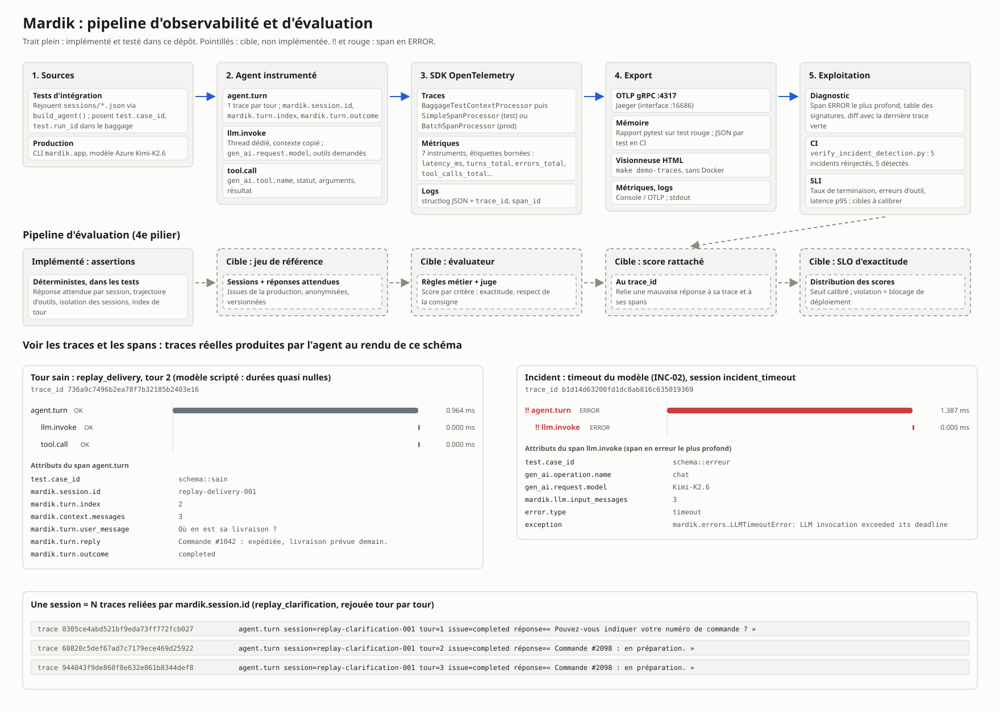

# Mardik Support Agent

Agent conversationnel de support client connecté à un modèle Azure (Kimi-K2.6 par défaut,
configurable),
instrumenté avec OpenTelemetry et validé par rejeu de sessions enregistrées.

Ce dépôt répond au brief « L'application qui ment sur sa santé ». L'application tombait en
panne sans qu'on sache pourquoi : l'observabilité était câblée sur le papier, mais rien
n'était émis en production, et la suite de rejeu ne rejouait pas vraiment les sessions. Ce
README décrit l'état corrigé, la façon de voir les traces, les incidents trouvés, leurs causes
et leurs correctifs.

- Les références « note de diagnostic, point N » renvoient aux notes de conception rangées hors
  du dépôt, dans le dossier parent (`../mardik-note-diagnostic-point-N.md`).
- Livrable de conception : [docs/schema-observabilite.md](docs/schema-observabilite.md)
  (points de trace, attributs, métriques, corrélation), et sa version
  [SVG](docs/schema-observabilite.svg).
- Pipeline d'observabilité et d'évaluation, avec des traces et des spans réels :
  [docs/pipeline-observabilite-eval.svg](docs/pipeline-observabilite-eval.svg).


- Journal de session : [docs/journal/](docs/journal/).

## Checklist du brief

Phase « Développement ». Chaque ligne renvoie à sa preuve ; état au 27 septembre 2026.

- [x] **Écrire des tests d'intégration rejouant des sessions réelles.** 20 tests d'intégration
  rejouent `sessions/*.json` sur les axes longitudinal et transversal ; un test en conditions
  réelles rejoue une session contre le vrai modèle Azure. Réserve : une seule session provient
  du dépôt d'origine, les quatre autres sont reconstituées (voir [Tests](#tests)).
- [x] **Instrumenter l'application (traces, métriques, logs structurés).** Spans `agent.turn`,
  `llm.invoke`, `tool.call` ; sept métriques ; logs JSON portant `trace_id` et `span_id`
  (voir [docs/schema-observabilite.md](docs/schema-observabilite.md)).
- [x] **Diagnostiquer et corriger au moins deux incidents récurrents.** Huit incidents corrigés,
  INC-01 à INC-07 (voir [Incidents](#incidents-récurrents--causes-et-correctifs)).
- [x] **Vérifier que les tests d'intégration détectent désormais ces incidents.**
  `make verify-incidents` réinjecte chaque défaut : 8 sur 8 détectés ; exécuté aussi en CI
  (voir [Preuve de détection](#preuve-de-détection)).
- [x] **Documenter causes et correctifs.** Pour chaque incident : symptôme, signature dans la
  trace, cause, correctif, test qui le détecte (voir
  [Incidents](#incidents-récurrents--causes-et-correctifs)).

## Sommaire

1. [Fonctionnalités](#fonctionnalités)
2. [Démarrage](#démarrage)
3. [Voir les traces et les spans](#voir-les-traces-et-les-spans)
4. [Tests](#tests)
5. [Diagnostiquer un test rouge](#diagnostiquer-un-test-rouge)
6. [Incidents récurrents : causes et correctifs](#incidents-récurrents--causes-et-correctifs)
7. [Configuration](#configuration)
8. [Organisation du code](#organisation-du-code)
9. [Limites connues](#limites-connues)

## Fonctionnalités

- Réponses aux questions de support via un agent qui appelle des outils métier (statut de
  commande, centre d'aide).
- Mémoire de session : l'historique d'une conversation est conservé et rejoué d'un tour à
  l'autre, y compris quand plusieurs tours d'une même session arrivent en même temps.
- Traces OpenTelemetry : un arbre de spans par tour (`agent.turn` → `llm.invoke`,
  `tool.call`), avec statut métier, identifiants de session et de tour, et contenu optionnel.
- Métriques : latences décomposées (tour, modèle, outil), tours par issue, erreurs par type,
  appels d'outil par statut, taille du contexte.
- Logs structurés JSON (structlog), chaque ligne portant `trace_id` et `span_id`.
- Suite de rejeu : les sessions enregistrées sont rejouées de bout en bout, sur les deux axes
  multi-sessions (plusieurs tours, plusieurs sessions simultanées).
- Lien test ↔ trace : chaque span porte le `test.case_id` du test qui l'a produit, et un test
  rouge affiche l'arbre de ses traces dans le rapport pytest.

## Stack

- Python 3.11, géré avec `uv`
- LangChain 0.3 + `langchain-azure-ai` (modèle Kimi-K2.6, servi par Azure AI Foundry sur la
  route `/openai/v1`)
- OpenTelemetry SDK (traces + métriques), exportateur OTLP/gRPC ; testé avec la version 1.45
- structlog 24 (logs JSON)
- pytest 8
- Jaeger all-in-one 1.57 (Docker) pour consulter les traces en local

## Démarrage

```bash
make install              # uv sync — installe les dépendances
cp .env.example .env      # puis renseigner les valeurs
make test                 # toute la suite (unitaires + intégration)
make demo-traces          # génère des traces et les ouvre dans le navigateur
make docs-svg             # régénère les deux SVG de docs/ après modification du schéma
```

Sous Windows, si l'interpréteur Python téléchargé par `uv` est bloqué par une stratégie de
contrôle d'application, créer l'environnement depuis le Python installé :
`uv venv --python <chemin vers python.exe 3.11>` puis `uv sync`.

Les tests et la démo n'ont besoin d'aucune clé Azure : ils utilisent des modèles scriptés.

## Voir les traces et les spans

OpenTelemetry n'a pas d'interface graphique : c'est un standard et un SDK qui produisent et
exportent les traces. Pour les lire, il faut une visionneuse. Deux options.

### Option 1 : visionneuse HTML, sans installation

```bash
make demo-traces
# équivalent : uv run python scripts/demo_traces.py
```

Le script rejoue les sessions enregistrées, quatre sessions concurrentes, un scénario sur
plusieurs tours et deux incidents (timeout du modèle, outil inconnu). Il écrit
`test-artifacts/trace-viewer.html` et l'ouvre dans le navigateur. La page affiche :

- à gauche, la liste des traces (un tour = une trace) avec session, tour, issue et
  `test.case_id` ; une case filtre les traces en erreur ;
- à droite, la cascade des spans de la trace choisie, positionnés dans le temps ;
- sous la cascade, pour le span sélectionné : statut, attributs, contenu (question, réponse,
  arguments d'outil), événements d'exception avec la pile, ressource.

Sur une trace en erreur, la page ouvre directement le span ERROR le plus profond, là où
commence la panne. La capture du contenu est activée pour la démo ; les sessions sont
synthétiques, aucune donnée personnelle n'est exportée.

### Option 2 : Jaeger (nécessite Docker)

```bash
make up                   # docker compose up -d (Jaeger all-in-one)
make demo-jaeger          # envoie les mêmes traces en OTLP vers localhost:4317
```

Ouvrir http://localhost:16686, choisir le service `mardik`, puis « Find Traces ». Une recherche
par tag `mardik.session.id=replay-delivery-001` regroupe les tours d'une session ;
`error=true` isole les traces en erreur.

Vérifié de bout en bout le 28 septembre 2026, par l'API de Jaeger après `make demo-jaeger` :
13 traces et 37 spans reçus pour le service `mardik`, dont 2 traces en erreur ; aucun
`llm.invoke` ni `tool.call` sans parent `agent.turn` ; la recherche par
`mardik.session.id` renvoie les 3 tours d'une session.

Docker Desktop exige que la virtualisation matérielle soit activée dans le BIOS/UEFI
([prérequis Docker](https://docs.docker.com/desktop/setup/install/windows-install/)) et WSL 2.
Une fois l'hyperviseur Windows actif, `Win32_Processor.VirtualizationFirmwareEnabled` renvoie
`False` même quand la virtualisation est activée : se fier plutôt à
`(Get-CimInstance Win32_ComputerSystem).HypervisorPresent` ou au message de `systeminfo`
« Un hyperviseur a été détecté ».

### Option 3 : Jaeger natif sous Windows, sans Docker

Jaeger publie des binaires Windows (`jaeger-1.57.0-windows-amd64.zip` dans les
[releases GitHub](https://github.com/jaegertracing/jaeger/releases/tag/v1.57.0)). Lancer
l'exécutable « all-in-one » de l'archive (nom exact non vérifié) expose les mêmes ports (4317 pour OTLP, 16686 pour l'interface), puis
`make demo-jaeger`. Non essayé ici : sur un poste soumis à une stratégie de contrôle
d'application, un exécutable téléchargé peut être bloqué.

## Tests

```bash
make test               # toute la suite
make test-unit          # tests unitaires
make test-integration   # rejeu de sessions, multi-sessions, incidents
make verify-incidents   # preuve que la suite d'intégration détecte chaque incident
```

### Ce que couvre la suite d'intégration

Les tests d'intégration ajoutés (`test_multi_session.py`, `test_trace_diagnostics.py`) passent
par `build_agent()`, le même assemblage qu'en production, autour d'un modèle scripté et d'une
télémétrie en mémoire. `test_replay.py`, hérité du dépôt, construit l'agent directement et a été
conservé tel quel. Chaque test vérifie à la fois la
réponse (ce que voit l'utilisateur) et la trace (ce qu'a fait l'agent).

| Test                                                   | Axe ou incident   | Ce qui est vérifié                                                                                   |
| ------------------------------------------------------ | ----------------- | ---------------------------------------------------------------------------------------------------- |
| `test_replayed_session_answers_from_its_own_context`   | Rejeu, INC-01     | Chaque session rejouée répond à partir de son historique ; un seul `lookup_order` avec le bon numéro |
| `test_every_recorded_session_has_an_expectation`       | Rejeu             | Aucune session ajoutée dans `sessions/` n'échappe aux tests                                          |
| `test_longitudinal_context_survives_every_turn`        | Longitudinal      | Le numéro donné au tour 2 est encore utilisé au tour 3 ; 3 traces, index 1 à 3                       |
| `test_concurrent_sessions_do_not_leak_into_each_other` | Transversal       | 8 sessions simultanées, chacune avec son marqueur ; aucune fuite                                     |
| `test_concurrent_turns_on_one_session_are_all_counted` | INC-03            | 16 tours simultanés d'une session : 16 tours comptés, index sans doublon                             |
| `test_every_turn_is_one_complete_trace`                | INC-04            | `llm.invoke` et `tool.call` sont enfants de `agent.turn`, même trace, statut OK                      |
| `test_llm_timeout_is_explicit_and_traced`              | INC-02            | `LLMTimeoutError` levée, spans ERROR, métrique `errors_total`, log `turn.failed`                     |
| `test_unknown_tool_is_not_absorbed`                    | Erreur d'outil    | L'outil inconnu fait échouer le tour ; span `tool.call` ERROR ; étiquette bornée                     |
| `test_spans_name_the_test_that_produced_them`          | Lien trace → test | Chaque span porte `test.case_id` et `test.run_id`                                                    |
| `test_logs_carry_the_trace_and_span_ids`               | Lien log → trace  | La ligne `turn.completed` pointe le span `agent.turn`                                                |
| `test_trace_report_points_at_the_failing_span`         | Lien test → trace | Le rapport d'un test rouge signale le span fautif et son exception                                   |
| `test_production_llm_is_given_the_agent_tools`         | INC-06            | Le client Azure de production reçoit les outils de l'agent (sans appel réseau)                       |
| `test_production_llm_accepts_the_openai_v1_route`      | INC-07            | Nom du déploiement transmis, version d'API et délai réglés (sans appel réseau)                       |
| `test_azure_sdk_timeout_surfaces_as_llm_timeout`       | INC-02            | Le timeout réel du SDK Azure ressort en `LLMTimeoutError`, span ERROR                                |

### Tests en conditions réelles

```bash
make test-live          # charge .env et appelle le vrai modèle Azure
```

`tests/live/test_live_azure.py` rejoue `replay_delivery` contre le modèle réel, via
`build_agent()`. Le modèle n'étant pas déterministe, le cas déclare ses répétitions et son seuil :
3 exécutions, au moins 2 réussies. Une réussite exige un seul appel à `lookup_order` avec le
numéro 1042 et la réponse « expédiée » ; le test vérifie aussi que `llm.invoke` porte l'usage de
tokens. Ces tests sont exclus par défaut (`-m 'not live'`) et ne tournent pas en CI, faute de
clé ; chaque exécution coûte quelques appels au modèle. Résultat du 27 septembre 2026 sur
Kimi-K2.6 : vert (au moins 2 exécutions réussies sur 3).

C'est ce test qui a révélé INC-06 et INC-07 : aucun test avec modèle scripté ne pouvait les voir.

Les sessions de `sessions/` sont au format des enregistrements d'origine. Seule
`replay_delivery.json` provient du dépôt initial ; les autres (`replay_return`,
`replay_clarification`, `replay_unknown_order`, `incident_timeout`) ont été reconstituées pour
couvrir les cas, faute d'export de production disponible. Une session réelle anonymisée
s'ajoute en déposant un fichier `replay_*.json` et en déclarant son résultat attendu dans
`EXPECTED_FINAL_REPLY`.

### Preuve de détection

`scripts/verify_incident_detection.py` copie le dépôt dans un dossier temporaire, y
réintroduit chaque défaut un par un, et lance la suite d'intégration (hors ligne). Le dossier de
travail n'est jamais modifié. Résultat mesuré le 27 septembre 2026 :

| Incident | Défaut réintroduit                         | Tests d'intégration rouges |
| -------- | ------------------------------------------ | -------------------------- |
| INC-01   | Rejeu du seul dernier message              | 6                          |
| INC-02   | Timeout transformé en `None`               | 4                          |
| INC-02b  | Timeout du SDK Azure non converti          | 1                          |
| INC-03   | Compteur de tours sans verrou              | 1                          |
| INC-04   | Contexte de trace non copié dans le thread | 3                          |
| INC-05   | Télémétrie ignorée par `build_agent`       | 14                         |
| INC-06   | Outils non transmis au modèle              | 2                          |
| INC-07   | Nom du déploiement ignoré (`model_name=`)  | 2                          |

INC-03 dépend d'une course entre threads : sa détection a été rejouée 10 fois, 10 fois
détectée. Sur le code corrigé, la suite complète a été lancée 20 fois, 20 fois verte.
La CI exécute ce script à chaque push sur `main` et à chaque pull request.

## Diagnostiquer un test rouge

Le mécanisme suit la note de diagnostic, point 4 : c'est le test qui nomme la trace.

1. **Rejouer avant de lire.** Relancer le test seul plusieurs fois
   (`uv run pytest "<id du test>"`). Échec constant : panne franche. Échec intermittent :
   trajectoire ou concurrence. Plus d'échec : suspecter l'environnement de test.
2. **Lire la section « Traces OpenTelemetry du cas »** du rapport pytest. Elle liste chaque
   trace, son `test.case_id`, et l'arbre de ses spans ; les spans en ERROR sont préfixés `!!`,
   suivis de leur exception. En CI, l'artefact `test-traces` contient un fichier JSON par test.
3. **Partir du span ERROR le plus profond**, puis comparer à la table des signatures.
4. **Clore seulement avec** la condition déclenchante reproductible, le span où l'état devient
   faux, et le test qui aurait attrapé la panne.

Exemple réel, obtenu en réintroduisant INC-04 :

```text
E       assert {'llm.invoke', 'tool.call'} <= {'tool.call'}
------------------------- Traces OpenTelemetry du cas -------------------------
2 trace(s), 3 span(s)
trace 5eec795870e733691c926239acaa85bf test.case_id=tests/integration/test_multi_session.py::test_every_turn_is_one_complete_trace
  agent.turn [OK] span=7bb27b14bbed105d mardik.session.id=replay-delivery-001 mardik.turn.index=2 mardik.turn.outcome=completed mardik.context.messages=3
    tool.call [OK] span=58171d621c04b479 gen_ai.tool.name=lookup_order mardik.tool.status=ok
trace dd1d5c3a508f234f1d9faf9bafc474c0 test.case_id=n/a
  llm.invoke [OK] span=159cbc8f7e857d66 mardik.llm.input_messages=3 mardik.llm.tool_calls_requested=[lookup_order]
```

Lecture : un tour devrait produire une trace, il en produit deux. `llm.invoke` est isolé et ne
porte pas de `test.case_id` : le contexte (span actif et baggage) ne l'a pas suivi dans le
thread de travail. La cause est dans `Agent._invoke_llm`.

### Table des signatures

| Signature dans la trace                                               | Cause probable                            | Vérification immédiate                                                 |
| --------------------------------------------------------------------- | ----------------------------------------- | ---------------------------------------------------------------------- |
| `llm.invoke` seul dans une autre trace, `test.case_id=n/a`            | Contexte non propagé au thread (INC-04)   | `copy_context()` dans `Agent._invoke_llm`                              |
| `mardik.context.messages` inférieur à la taille de la session rejouée | Historique non chargé (INC-01)            | `runner.replay` charge-t-il les messages précédents ?                  |
| `llm.invoke` ERROR `error.type=timeout`                               | Modèle trop lent ou indisponible (INC-02) | Latence `llm_latency_ms`, état du fournisseur                          |
| Deux `agent.turn` d'une session avec le même `mardik.turn.index`      | Course sur l'état partagé (INC-03)        | Rejouer en série : si l'échec disparaît, c'est une course              |
| Aucun span après un tour                                              | Télémétrie non câblée (INC-05)            | Type de `agent.telemetry`                                              |
| `tool.call` ERROR `error.type=unknown_tool`                           | Modèle qui demande un outil absent        | Outils déclarés au modèle, description des outils                      |
| Trace entièrement OK, assertion sur la réponse rouge                  | Panne sémantique                          | Comparer question, réponse et arguments d'outil (attributs de contenu) |

## Incidents récurrents : causes et correctifs

État de départ mesuré : **9 tests sur 10 en échec** (`pytest`, dépôt téléchargé sans
modification). Cinq incidents distincts en rendent compte (INC-01 à INC-05). Trois autres
(INC-02b, INC-06, INC-07) sont apparus au premier test en conditions réelles. Chacun est
documenté ci-dessous :
symptôme, signature, cause, correctif, test qui le détecte désormais.

### INC-01 : le rejeu perdait le contexte de la session

- **Symptôme.** Au rejeu de `replay_delivery`, l'agent redemande le numéro de commande alors
  que le client l'a donné au premier message.
- **Signature.** `mardik.context.messages=1` pour une session de 3 messages.
- **Cause.** `runner.replay` n'envoyait que le dernier message à l'agent ; l'historique
  enregistré n'était jamais chargé. Le « test d'intégration » testait un tour isolé : la suite
  de rejeu ne rejouait pas de session.
- **Correctif.** `replay` charge tous les messages précédents dans le stockage et compte les
  tours utilisateur déjà joués, puis joue le dernier tour. `replay_turn_by_turn` ajoute un
  rejeu tour par tour pour l'axe longitudinal.
- **Détecté par.** `test_replayed_session_answers_from_its_own_context` (4 sessions),
  `test_replay_preserves_session_context`.

### INC-02 : le timeout du modèle était avalé

- **Symptôme.** Sur timeout du modèle, l'erreur remontée était
  `AttributeError: 'NoneType' object has no attribute 'content'`, sans rapport avec la cause.
- **Signature.** Avant : aucune. Après : `llm.invoke` ERROR `error.type=timeout`,
  `agent.turn` ERROR `error.type=LLMTimeoutError`.
- **Cause.** `_invoke_llm_sync` capturait `TimeoutError` et renvoyait `None`. Par ailleurs,
  une exception levée dans le thread de travail était perdue.
- **Correctif.** Le timeout est converti en `LLMTimeoutError` (exception de domaine, cause
  chaînée) ; l'exception du thread est relancée dans l'appelant. Le tour est compté dans
  `errors_total` et journalisé (`turn.failed`). La session `incident_timeout.json`, référencée
  par un test mais absente du dépôt, a été ajoutée.
- **Complément observé en conditions réelles (INC-02b).** Le SDK Azure ne lève pas
  `TimeoutError` mais `azure.core.exceptions.ServiceResponseTimeoutError`, qui n'en hérite pas.
  `llm.AzureLLM` la convertit ; le délai de lecture passe de 300 s (défaut d'azure-core) à 30 s,
  réglable par `MARDIK_LLM_TIMEOUT_S`.
- **Détecté par.** `test_llm_timeout_is_explicit_and_traced`, `test_replay_timeout_incident`,
  `test_trace_report_points_at_the_failing_span`, `test_azure_sdk_timeout_surfaces_as_llm_timeout`.

### INC-03 : le compteur de tours se corrompait sous charge

- **Symptôme.** 20 threads × 50 tours comptaient 52 tours au lieu de 1 000.
- **Signature.** Deux spans `agent.turn` d'une même session portent le même
  `mardik.turn.index`.
- **Cause.** `SessionStore.record_turn` fait lecture, attente, écriture sans verrou : deux tours
  simultanés lisent la même valeur. Le stockage est partagé entre tous les workers.
- **Correctif.** Un verrou protège toutes les opérations du stockage ; `record_turn` renvoie
  l'index du tour, porté par le span.
- **Détecté par.** `test_concurrent_turns_on_one_session_are_all_counted` (intégration),
  `test_record_turn_counts_every_concurrent_turn` (unitaire).

### INC-04 : les traces du modèle étaient orphelines

- **Symptôme.** Le span de l'appel au modèle n'apparaissait pas sous le tour : impossible de
  savoir quel tour avait appelé le modèle, ni combien de temps il y avait passé.
- **Signature.** Voir l'exemple réel ci-dessus : deux traces pour un tour.
- **Cause.** L'appel au modèle s'exécute dans un `threading.Thread`. Le contexte
  OpenTelemetry vit dans des `contextvars`, qu'un nouveau thread n'hérite pas.
- **Correctif.** `contextvars.copy_context()` avant le démarrage du thread, puis `ctx.run(...)`.
- **Détecté par.** `test_every_turn_is_one_complete_trace`,
  `test_trace_context_propagated_across_threads`.

### INC-05 : la télémétrie n'était pas câblée en production

- **Symptôme.** L'agent de production n'émettait aucun span ni aucune métrique, alors que le
  README d'origine annonçait une application instrumentée. C'est le cœur du « mensonge ».
- **Signature.** Aucun span, aucune métrique après un tour.
- **Cause.** `build_agent` ignorait son paramètre `telemetry` et ne construisait pas de
  télémétrie par défaut : l'agent de production tournait avec `NoOpTelemetry`.
- **Correctif.** `build_agent` transmet la télémétrie reçue, ou construit la télémétrie de
  production (`build_default_telemetry` : OTLP par lots, ressource `service.name`,
  `service.version`, `deployment.environment.name`).
- **Détecté par.** Les tests d'intégration qui passent par `build_agent` (14 deviennent rouges
  si le défaut revient), et `test_build_agent_wires_telemetry`.

### Autres défauts corrigés

| Défaut                                                       | Correctif                                                                  |
| ------------------------------------------------------------ | -------------------------------------------------------------------------- |
| Aucun span `tool.call`                                       | Span par outil, avec nom, statut, arguments et résultat                    |
| Métrique `latency_ms` déclarée mais jamais enregistrée       | Enregistrée à chaque tour, avec l'issue en étiquette                       |
| `print` à la place d'un log structuré                        | Logs `turn.completed` et `turn.failed` en JSON                             |
| Outil inconnu : `KeyError` brute                             | `ToolExecutionError`, span ERROR, étiquette `tool=unknown`                 |
| Plusieurs appels d'outil : seul le dernier résultat conservé | Résultats joints                                                           |
| Spans réussis laissés au statut UNSET                        | Statut OK explicite, ERROR si la réponse est vide                          |
| CI limitée aux tests unitaires                               | CI : lint, unitaires, intégration, preuve de détection, artefact de traces |

### INC-06 : le modèle réel ne recevait pas les outils

- **Symptôme.** Face à « Où en est la livraison de ma commande #1042 ? », le modèle réel ne
  pouvait pas consulter le statut : il ne connaissait pas l'outil `lookup_order`.
- **Signature.** `mardik.llm.tool_calls_requested=[]` et aucun span `tool.call` pour une question
  qui exige une consultation.
- **Cause.** `llm.get_llm` construisait le client sans `bind_tools`. Invisible avec le modèle
  scripté des tests, qui renvoie ses appels d'outil sans qu'on les lui déclare.
- **Correctif.** `build_agent` passe les outils à `get_llm`, qui les lie au modèle.
- **Détecté par.** `test_production_llm_is_given_the_agent_tools` (hors ligne) et
  `test_real_model_looks_the_order_up_from_the_history` (conditions réelles).

### INC-07 : le nom du déploiement n'était jamais transmis

- **Symptôme.** Tout appel au modèle réel échouait.
- **Signature.** Trace du premier test réel : `llm.invoke` ERROR,
  `HttpResponseError: Missed model deployment`.
- **Cause.** Le client déclare ce champ sous l'alias `model` ; `model_name=` était ignoré sans
  erreur. S'y ajoutait, sur la route `/openai/v1`, un refus de la version d'API envoyée par
  défaut (HTTP 400 « API version not supported ») : comportement observé, non documenté.
- **Correctif.** `model=` au lieu de `model_name=` ; `api_version="preview"` sur la route v1.
- **Détecté par.** `test_production_llm_accepts_the_openai_v1_route` (hors ligne) et le test en
  conditions réelles.

## Configuration

Variables lues depuis l'environnement (voir `.env.example`) :

| Variable                      | Défaut                  | Rôle                                                                    |
| ----------------------------- | ----------------------- | ----------------------------------------------------------------------- |
| `AZURE_AI_ENDPOINT`           | vide                    | Point d'accès Azure AI Inference                                        |
| `AZURE_AI_API_KEY`            | vide                    | Clé d'API ; ne jamais la versionner                                     |
| `AZURE_AI_MODEL`              | `Kimi-K2.6`             | Modèle ; reporté dans `gen_ai.request.model`                            |
| `OTEL_EXPORTER_OTLP_ENDPOINT` | `http://localhost:4317` | Collecteur OTLP gRPC                                                    |
| `OTEL_SERVICE_NAME`           | `mardik`                | `service.name` des traces et métriques                                  |
| `APP_ENV`                     | `development`           | `deployment.environment.name`                                           |
| `LOG_LEVEL`                   | `INFO`                  | Niveau des logs                                                         |
| `MARDIK_TRACE_CONTENT`        | `false`                 | Écrit question, réponse, arguments et résultats d'outil dans les spans  |
| `MARDIK_METRICS_EXPORTER`     | `console`               | `console`, `otlp` ou `none`                                             |
| `MARDIK_LLM_TIMEOUT_S`        | `30`                    | Délai de lecture d'un appel au modèle, en secondes (par lecture réseau) |
| `MARDIK_LLM_MAX_RETRIES`      | `2`                     | Nouvelles tentatives du SDK Azure (les timeouts ne sont pas retentés)   |
| `MARDIK_TRACE_ARTIFACTS`      | non défini              | Dossier où les tests écrivent un JSON de traces par test (CI)           |
| `MARDIK_SESSIONS_DIR`         | `sessions`              | Dossier des sessions enregistrées                                       |

`MARDIK_TRACE_CONTENT` expose des données personnelles potentielles. Aucun masquage n'est
implémenté : le laisser à `false` en production.

## Organisation du code

```
src/mardik/
  agent.py        Orchestration d'un tour : LLM, appels d'outils, spans, métriques, logs
  app.py          Assemblage de l'agent (télémétrie de production incluse) + CLI
  config.py       Configuration lue depuis l'environnement
  errors.py       Exceptions de domaine (LLMTimeoutError, ToolExecutionError)
  llm.py          Client Azure : outils liés, délai, conversion des timeouts du SDK
  runner.py       Rejeu de sessions enregistrées (dernier tour, ou tour par tour)
  session.py      Stockage des sessions partagé entre tours concurrents, verrouillé
  telemetry.py    Tracer, logger, instruments de métriques, lien baggage de test
sessions/         Sessions enregistrées rejouées par les tests
tests/
  conftest.py         Modèles scriptés, télémétrie en mémoire, rapport de traces sur échec
  tracing_support.py  Outils partagés : baggage de test, rendu des traces, concurrence
  unit/               Tests unitaires
  integration/        Rejeu, multi-sessions, incidents tracés, assemblage de production
  live/               Tests en conditions réelles contre le modèle Azure (make test-live)
scripts/
  demo_traces.py                 Traces de démonstration : visionneuse HTML ou Jaeger
  render_docs_svg.py             Génère les SVG de docs/ (schéma, pipeline avec traces réelles)
  trace_viewer.py                Génération de la visionneuse HTML autonome
  verify_incident_detection.py   Preuve que la suite détecte chaque incident
docs/
  schema-observabilite.md   Livrable de conception : points de trace et métriques
  schema-observabilite.svg  Le même document en SVG (généré)
  pipeline-observabilite-eval.svg  Pipeline d'observabilité et d'évaluation (généré)
  journal/                  Journaux de session
docker-compose.yml  Jaeger all-in-one pour la collecte locale des traces
```

## Commandes utiles

```bash
make fmt        # ruff format + autofix
make lint       # ruff check
make typecheck  # mypy
make down       # arrête les services Docker
```

## Limites connues

- **Délai par lecture, pas d'échéance globale.** `MARDIK_LLM_TIMEOUT_S` borne chaque lecture
  réseau ; une réponse qui arrive lentement par morceaux peut durer plus longtemps.
- **Test réel limité.** Un seul scénario (`replay_delivery`) est rejoué contre le vrai modèle,
  hors CI. Les autres tests utilisent un modèle scripté. Aucun score d'évaluation n'est calculé.
- **Métriques non persistées en local.** Jaeger ne stocke que les traces.
- **Pas de masquage** des données personnelles dans les attributs de contenu.
- **Formatage.** `ruff format --check` signale des fichiers non formatés, y compris des
  fichiers d'origine non modifiés ; aucun reformatage global n'a été appliqué pour garder le
  diff lisible.

## License

MIT

## Contact

es.agwu.19@eigsi.fr
