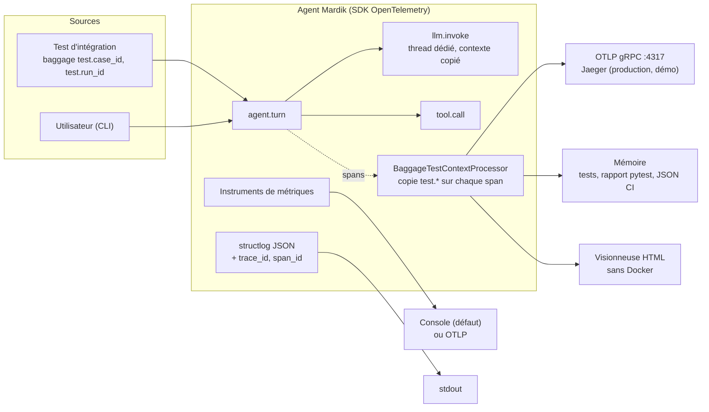
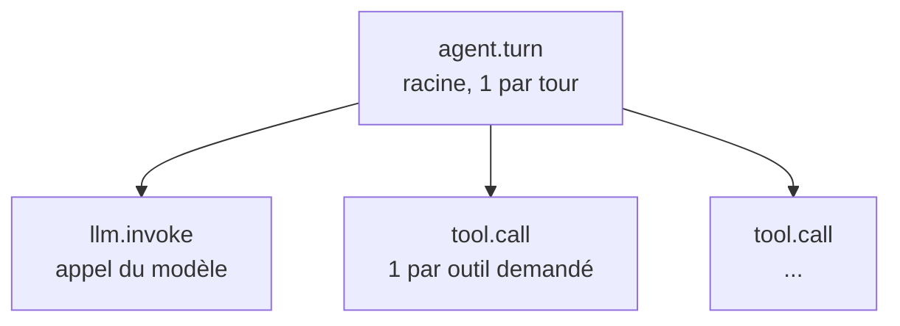

# Schéma d'observabilité de l'agent Mardik

> Livrable de conception : points de trace et métriques.
> Version 1, 27 septembre 2026. S'applique au code de ce dépôt (`src/mardik/`).
> Dérive des notes de diagnostic (points 1 à 4), rangées hors du dépôt, dans le dossier parent :
> `../mardik-note-diagnostic-point-{1,2,3,4}.md`. Le document distingue ce qui est
> **implémenté** de ce qui reste une **cible** : rien n'est présenté comme fait s'il ne l'est pas.

## 1. Objet

L'application « ment sur sa santé » : elle mesurait la disponibilité et laissait croire à la
santé. Ce schéma fixe ce que l'agent émet pour qu'une panne soit **visible**, **localisable**
et **reliée au test qui l'a provoquée** :

- des **traces** : un arbre de spans par tour de conversation ;
- des **métriques** : agrégats à étiquettes bornées ;
- des **logs structurés** : JSON, chaque ligne rattachée à sa trace ;
- un **lien test ↔ trace** : chaque span nomme le test qui l'a produit.

Le dictionnaire ci-dessous est la référence. Le code (`telemetry.py`, `agent.py`) doit
rester conforme ; toute évolution de l'un passe par l'autre.

## 2. Vue d'ensemble

| Flux            | Exportateur en production                 | Exportateur en test                          |
| --------------- | ----------------------------------------- | -------------------------------------------- |
| Traces          | OTLP gRPC par lots (`BatchSpanProcessor`) | Mémoire, synchrone (`SimpleSpanProcessor`)   |
| Métriques       | Console par défaut, OTLP en option        | Lecteur en mémoire (`InMemoryMetricReader`)  |
| Logs            | JSON sur stdout                           | Capturés par `structlog.testing` ou `capsys` |
| Lien test-trace | Non applicable                            | Baggage `test.*` recopié sur chaque span     |

## 3. Hiérarchie de spans

### 3.1 Implémentée

Une trace correspond à **un tour**, pas à une session. Les tours d'une même session sont reliés
par l'attribut `mardik.session.id` (note, point 3, § 6).

| Span         | Composant (note, point 3, § 2)                | Ouvert dans              | Enfants                   |
| ------------ | --------------------------------------------- | ------------------------ | ------------------------- |
| `agent.turn` | Gestionnaire de session et boucle de contrôle | `Agent.run_turn`         | `llm.invoke`, `tool.call` |
| `llm.invoke` | Client modèle                                 | `Agent._invoke_llm_sync` | aucun                     |
| `tool.call`  | Routeur de décision et exécuteur d'outil      | `Agent._dispatch_tool`   | aucun                     |

`llm.invoke` s'exécute dans un thread de travail. Le contexte OpenTelemetry y est transmis par
`contextvars.copy_context()` ; sans cela, le span part dans une trace orpheline (incident INC-04).

Les noms de spans (`agent.turn`, `llm.invoke`, `tool.call`) sont ceux qu'attendaient les tests
du dépôt. Ils ne suivent pas la forme recommandée par les conventions GenAI
(`chat {modèle}`, `execute_tool {outil}`) ; l'attribut `gen_ai.operation.name` porte
l'information normalisée. Renommer est possible, mais casse les requêtes existantes.

### 3.2 Écarts avec la cible des notes

| Span cible (note, point 3) | Statut         | Raison                                                                                   |
| -------------------------- | -------------- | ---------------------------------------------------------------------------------------- |
| `request`                  | Non implémenté | Pas de frontière HTTP : l'entrée est un appel Python ; `agent.turn` est la racine        |
| `session.load`, `persist`  | Non implémenté | Stockage en mémoire, sans latence propre ; attributs de session portés par `agent.turn`  |
| `context.build`            | Partiel        | Taille du contexte en nombre de messages (`mardik.context.messages`), pas en tokens      |
| `iteration`                | Non implémenté | L'agent ne boucle pas : un appel modèle, puis les outils ; aucune itération à compter    |
| `decision.parse`           | Non implémenté | Pas de parsing : les appels d'outil arrivent structurés ; noms demandés sur `llm.invoke` |
| `tool.http`                | Non implémenté | Les outils sont des fonctions locales, sans appel réseau                                 |
| `guardrail.check`          | Non implémenté | Aucun garde-fou dans le code                                                             |
| `response.emit`            | Partiel        | Réponse portée par `agent.turn` (`mardik.turn.reply`), statut `empty` si vide            |

Le jour où l'agent boucle (réinjection du résultat d'outil au modèle), le span `iteration` et
l'attribut `mardik.iteration.terminated_by` deviennent obligatoires : sans eux, une boucle est
invisible.

## 4. Dictionnaire d'attributs

Deux espaces de noms : `gen_ai.*` et `error.type` là où une convention OpenTelemetry existe,
`mardik.*` pour le reste. Les attributs marqués « contenu » ne sont écrits que si
`MARDIK_TRACE_CONTENT=true` (voir § 8), et sont tronqués à 1 000 caractères.

### 4.1 `agent.turn`

| Attribut                   | Type   | Exemple                          | Rôle                                            | Contenu |
| -------------------------- | ------ | -------------------------------- | ----------------------------------------------- | ------- |
| `mardik.session.id`        | chaîne | `replay-delivery-001`            | Relier les N traces d'une session               | non     |
| `mardik.turn.index`        | entier | `2`                              | Axe longitudinal ; doublon = course (INC-03)    | non     |
| `mardik.turn.outcome`      | chaîne | `completed`, `empty`, `error`    | Issue métier du tour                            | non     |
| `mardik.context.messages`  | entier | `3`                              | Taille du contexte envoyé ; trop petit = INC-01 | non     |
| `error.type`               | chaîne | `LLMTimeoutError`                | Classe de l'erreur qui a fait échouer le tour   | non     |
| `mardik.turn.user_message` | chaîne | `Où en est sa livraison ?`       | Question du tour                                | oui     |
| `mardik.turn.reply`        | chaîne | `Commande #1042 : expédiée, ...` | Réponse servie                                  | oui     |
| `test.case_id`             | chaîne | `tests/integration/...::test_x`  | Lien trace vers test (§ 7)                      | non     |
| `test.run_id`              | chaîne | `local` ou `GITHUB_RUN_ID`       | Lien trace vers exécution de CI                 | non     |

### 4.2 `llm.invoke`

| Attribut                          | Type             | Exemple           | Rôle                                                                            | Contenu |
| --------------------------------- | ---------------- | ----------------- | ------------------------------------------------------------------------------- | ------- |
| `gen_ai.operation.name`           | chaîne           | `chat`            | Type d'opération GenAI                                                          | non     |
| `gen_ai.request.model`            | chaîne           | `Kimi-K2.6`       | Modèle demandé ; à comparer avec la dernière trace verte du même `test.case_id` | non     |
| `mardik.llm.input_messages`       | entier           | `3`               | Messages réellement transmis au modèle                                          | non     |
| `mardik.llm.tool_calls_requested` | liste de chaînes | `[lookup_order]`  | Décision du modèle ; trajectoire                                                | non     |
| `error.type`                      | chaîne           | `timeout`         | Cause d'échec de l'appel                                                        | non     |
| `gen_ai.usage.input_tokens`       | entier           | `41`              | Tokens en entrée, si le client les renvoie (modèle réel)                        | non     |
| `gen_ai.usage.output_tokens`      | entier           | `18`              | Tokens en sortie, si le client les renvoie (modèle réel)                        | non     |
| `mardik.llm.completion`           | chaîne           | `Pouvez-vous ...` | Texte produit par le modèle                                                     | oui     |

### 4.3 `tool.call`

| Attribut                | Type   | Exemple                                 | Rôle                                   | Contenu |
| ----------------------- | ------ | --------------------------------------- | -------------------------------------- | ------- |
| `gen_ai.operation.name` | chaîne | `execute_tool`                          | Type d'opération GenAI                 | non     |
| `gen_ai.tool.name`      | chaîne | `lookup_order`                          | Outil demandé, même inconnu            | non     |
| `mardik.tool.status`    | chaîne | `ok`, `error`                           | Statut réel de l'exécution             | non     |
| `error.type`            | chaîne | `unknown_tool`, `tool_failure`          | Nature de l'échec                      | non     |
| `mardik.tool.arguments` | chaîne | `{"order_id": "1042"}` (JSON sérialisé) | Arguments passés ; rejouabilité du cas | oui     |
| `mardik.tool.result`    | chaîne | `Commande #1042 : expédiée, ...`        | Observation renvoyée                   | oui     |

### 4.4 Ressource (tous les spans et métriques)

| Attribut                      | Source               | Exemple       |
| ----------------------------- | -------------------- | ------------- |
| `service.name`                | `OTEL_SERVICE_NAME`  | `mardik`      |
| `service.version`             | `mardik.__version__` | `0.1.0`       |
| `deployment.environment.name` | `APP_ENV`            | `development` |

## 5. Règles de statut de span

Un span est ERROR d'après le **résultat métier**, pas seulement l'absence d'exception
(note, point 3, § 5). Un tour réussi est marqué OK explicitement, jamais laissé UNSET.

| Situation                 | `llm.invoke` | `tool.call` | `agent.turn` | `mardik.turn.outcome` |
| ------------------------- | ------------ | ----------- | ------------ | --------------------- |
| Tour nominal              | OK           | OK          | OK           | `completed`           |
| Réponse vide servie       | OK           | OK          | ERROR        | `empty`               |
| Timeout du modèle         | ERROR        | absent      | ERROR        | `error`               |
| Outil inconnu ou en échec | OK           | ERROR       | ERROR        | `error`               |

Les spans en ERROR portent l'exception (événement `exception` : type, message, pile), sauf la
réponse vide : le statut ERROR y est posé directement (description `empty reply`), sans exception.

## 6. Métriques

Étiquettes **bornées uniquement** : jamais `session_id`, `trace_id`, identifiant utilisateur ni
texte libre (note, point 2, § 3.2). Un nom d'outil inconnu est ramené à `unknown`.

| Métrique           | Type        | Unité    | Étiquettes       | Strate (note, point 2) | Question à laquelle elle répond                          |
| ------------------ | ----------- | -------- | ---------------- | ---------------------- | -------------------------------------------------------- |
| `latency_ms`       | histogramme | ms       | `outcome`        | 1, infrastructure      | Latence du tour, en p50, p95, p99, par issue             |
| `llm_latency_ms`   | histogramme | ms       | aucune           | 1, infrastructure      | Part de la latence due au modèle                         |
| `tool_latency_ms`  | histogramme | ms       | `tool`           | 1, infrastructure      | Part de la latence due à chaque outil                    |
| `turns_total`      | compteur    | tours    | `outcome`        | 2, trajectoire         | Taux de terminaison = `completed` / total                |
| `errors_total`     | compteur    | tours    | `error.type`     | 1, infrastructure      | Quelles erreurs, à quelle fréquence                      |
| `tool_calls_total` | compteur    | appels   | `tool`, `status` | 2, trajectoire         | Distribution de sélection d'outils, taux d'échec d'outil |
| `context_messages` | histogramme | messages | aucune           | 3, session             | Croissance du contexte au fil des tours                  |

Règle des paires (note, point 2, § 3.1) : `turns_total` se lit avec son étiquette `outcome`,
`tool_calls_total` avec `status`, `latency_ms` avec `outcome`. Aucun volume n'est lu seul.

Indicateurs dérivés, **cibles à calibrer** sur une période de référence avant toute alerte :

| Indicateur (SLI)                | Calcul                                                  | Action si la cible est violée |
| ------------------------------- | ------------------------------------------------------- | ----------------------------- |
| Taux de terminaison             | `turns_total{outcome="completed"}` / `turns_total`      | Blocage de déploiement        |
| Taux d'erreur d'outil           | `tool_calls_total{status="error"}` / `tool_calls_total` | Ouverture d'incident          |
| Latence p95 du tour             | p95 de `latency_ms`, fenêtre glissante                  | Alerte                        |
| Taux d'échec des tests de rejeu | Cas rouges / cas totaux en CI                           | Blocage de fusion             |

## 7. Corrélation

| Lien                | Mécanisme                                                                                                           | Où le lire                                   |
| ------------------- | ------------------------------------------------------------------------------------------------------------------- | -------------------------------------------- |
| Log vers trace      | Processeur structlog `add_trace_context` : `trace_id`, `span_id` sur chaque ligne                                   | Ligne JSON `turn.completed` ou `turn.failed` |
| Tours d'une session | Attribut `mardik.session.id` sur `agent.turn`                                                                       | Recherche par attribut dans Jaeger           |
| Trace vers test     | Baggage `test.case_id`, `test.run_id` recopié sur chaque span                                                       | Attributs du span                            |
| Test vers trace     | Rapport pytest : section « Traces OpenTelemetry du cas » sur test rouge ; JSON par test si `MARDIK_TRACE_ARTIFACTS` | Sortie pytest, artefact CI `test-traces`     |
| Thread du modèle    | `contextvars.copy_context()` avant le thread                                                                        | `llm.invoke` enfant de `agent.turn`          |

Frontières de processus : l'application actuelle n'en a pas (appel direct au SDK Azure). Si un
service intermédiaire apparaît, le contexte doit traverser via l'en-tête W3C `traceparent`.
Le SDK configure par défaut les propagateurs `tracecontext,baggage` (`OTEL_PROPAGATORS`) ;
l'API seule, sans SDK, ne propage rien.

## 8. Contenu, données personnelles et échantillonnage

| Sujet                         | Choix                                                                                                         |
| ----------------------------- | ------------------------------------------------------------------------------------------------------------- |
| Contenu dans les spans        | Désactivé par défaut (`MARDIK_TRACE_CONTENT=false`) ; activé en test, en CI et dans la démo                   |
| Troncature                    | 1 000 caractères par attribut de contenu                                                                      |
| Masquage (redaction)          | **Non implémenté.** Tant qu'il ne l'est pas, ne pas activer le contenu en production                          |
| Secrets                       | Aucune clé ni en-tête d'authentification n'est placé dans un span ou un log                                   |
| Échantillonnage en test, CI   | 100 % (échantillonneur par défaut `parentbased_always_on`, export synchrone)                                  |
| Échantillonnage en production | 100 % aujourd'hui ; cible : échantillonnage en queue (tail-based) biaisé vers les erreurs, dans un collecteur |

Les piles d'exception enregistrées contiennent des chemins de fichiers locaux ; elles ne
contiennent pas de contenu utilisateur au-delà du message d'exception.

## 9. Traçabilité : chaque signal sert un diagnostic

| Incident ou panne type          | Signal qui le révèle                                                                                   |
| ------------------------------- | ------------------------------------------------------------------------------------------------------ |
| INC-01 perte du contexte        | `mardik.context.messages` inférieur au nombre de messages de la session rejouée                        |
| INC-02 timeout avalé            | `llm.invoke` ERROR `error.type=timeout` ; `errors_total{error.type="LLMTimeoutError"}`                 |
| INC-03 course sur le compteur   | Deux `agent.turn` d'une même session avec le même `mardik.turn.index`                                  |
| INC-04 trace orpheline          | `llm.invoke` sans parent, dans une trace différente de `agent.turn`                                    |
| INC-05 télémétrie non câblée    | Aucun span ni point de métrique après un tour                                                          |
| INC-02b timeout du SDK Azure    | `llm.invoke` ERROR `error.type=timeout`, cause `ServiceResponseTimeoutError`                           |
| INC-06 outils non transmis      | `mardik.llm.tool_calls_requested=[]` et aucun `tool.call` pour une question qui exige une consultation |
| INC-07 déploiement non transmis | `llm.invoke` ERROR `HttpResponseError: Missed model deployment`                                        |
| Outil inconnu                   | `tool.call` ERROR `error.type=unknown_tool` ; `tool_calls_total{tool="unknown"}`                       |
| Réponse vide                    | `mardik.turn.outcome=empty` ; `turns_total{outcome="empty"}`                                           |

## 10. Limites assumées

- **Pas de pilier « évaluations ».** Aucun score de justesse n'est rattaché aux traces. Les
  métriques ci-dessus décrivent le comportement de l'agent, pas l'exactitude de ses réponses
  (note, point 2, § 5).
- **Tokens sans coût.** `gen_ai.usage.input_tokens` et `output_tokens` sont enregistrés quand le
  client les renvoie (modèle réel) ; le coût n'est pas calculé.
- **Conventions GenAI d'OpenTelemetry non stables.** Les attributs `gen_ai.*` peuvent changer ;
  l'espace `mardik.*` est figé par ce document.
- **Métriques non persistées en local.** Jaeger ne stocke pas de métriques ; un backend
  (Prometheus ou collecteur OpenTelemetry) reste à ajouter pour tracer des tableaux de bord.

## 11. Sources

Vérifiées le 27 septembre 2026.

- Conventions GenAI (statut Development, noms de spans, `gen_ai.operation.name`,
  `gen_ai.request.model`, `gen_ai.tool.name`) : elles ont quitté opentelemetry.io pour le dépôt
  <https://github.com/open-telemetry/semantic-conventions-genai/blob/main/docs/gen-ai/gen-ai-spans.md>
- `error.type` (stable) : <https://opentelemetry.io/docs/specs/semconv/registry/attributes/error/>
- `deployment.environment.name`, qui remplace `deployment.environment` :
  <https://opentelemetry.io/docs/specs/semconv/registry/attributes/deployment/>
- `OTEL_SERVICE_NAME` dans le SDK Python :
  <https://opentelemetry-python.readthedocs.io/en/latest/sdk/environment_variables.html>
- Propagateurs par défaut `tracecontext,baggage` :
  <https://opentelemetry.io/docs/specs/otel/configuration/sdk-environment-variables/>
- Capture du contenu désactivée par défaut dans les instrumentations GenAI Python :
  <https://opentelemetry-python-contrib.readthedocs.io/en/latest/instrumentation-genai/util.html>
- Jaeger 1.57 accepte OTLP (4317, 4318) pour les traces seulement :
  <https://www.jaegertracing.io/docs/1.57/apis/>
- Échantillonneur par défaut `parentbased_always_on` : lu dans le SDK installé
  (`opentelemetry/sdk/trace/sampling.py`, version 1.45).
